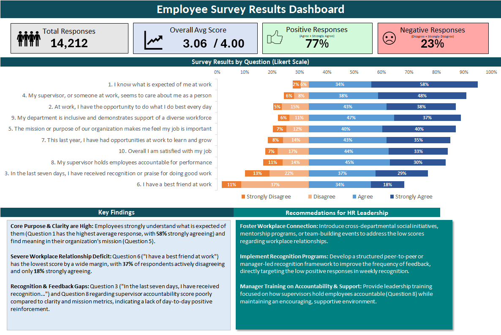

# Employee Survey Results Dashboard

## Project Overview

This project analyzes employee survey responses from approximately 1,500 city employees in Washington state. The goal was to clean, profile, summarize, and visualize survey response data in Excel so HR leadership could quickly identify employee satisfaction trends, concern areas, and improvement opportunities.

The final deliverable is an Excel-based survey dashboard with Likert-scale visualizations, KPI summaries, response distribution analysis, and actionable recommendations for HR decision-making.

  

---

## Business Objective

HR leaders often collect employee survey data but struggle to turn raw responses into clear, actionable insights. This project focuses on transforming raw survey records into a structured report that answers:

- Which survey questions received the strongest positive responses?
- Which areas showed the highest level of dissatisfaction or concern?
- What percentage of employees responded positively or negatively?
- Where should HR leadership focus improvement efforts first?
- How can future survey reporting be standardized and improved?

---

## Dataset Summary

The dataset contains employee survey responses from city employees in Washington state.

| Metric | Value |
|---|---:|
| Records | 14,725 |
| Fields | 10 |
| File Type | Excel |
| Data Structure | Single table |
| Response Scale | 1–4 Likert scale |

### Response Scale

| Response Value | Meaning |
|---:|---|
| 1 | Strongly Disagree |
| 2 | Disagree |
| 3 | Agree |
| 4 | Strongly Agree |

Responses of `0` were excluded from average score calculations because they do not represent a valid Likert-scale response.

---

## Tools Used

- Microsoft Excel
- PivotTables
- Excel formulas
- Data cleaning
- Conditional formatting
- 100% stacked bar charts
- Likert-scale visualization
- KPI dashboard design

---

## Data Preparation Process

The first step was to profile and clean the dataset before building the dashboard.

### Data Quality Checks

I reviewed the dataset for:

- Blank response records
- Duplicate records
- Inconsistent department names
- Inconsistent question text
- Missing values
- Invalid response values
- Count and frequency issues by department and question

### Cleaning Steps

The dataset was cleaned by:

- Removing records with blank responses
- Removing duplicate records across all fields
- Standardizing inconsistent text values
- Creating a clean chart source table
- Calculating response counts for each survey question
- Calculating response percentages for each Likert-scale value
- Excluding invalid zero responses from average score calculations
- Sorting questions by average response score

---

## Analysis Approach

The analysis focused on converting raw survey responses into a question-level summary.

For each survey question, I calculated:

- Count of response 1
- Count of response 2
- Count of response 3
- Count of response 4
- Percentage of each response type
- Average response score
- Combined negative response rate
- Combined positive response rate

# Employee Survey Results Dashboard

## Project Overview

This project analyzes employee survey responses from approximately 1,500 city employees in Washington state. The goal was to clean, profile, summarize, and visualize survey response data in Excel so HR leadership could quickly identify employee satisfaction trends, concern areas, and improvement opportunities.

The final deliverable is an Excel-based survey dashboard with Likert-scale visualizations, KPI summaries, response distribution analysis, and actionable recommendations for HR decision-making.

---

## Business Objective

HR leaders often collect employee survey data but struggle to turn raw responses into clear, actionable insights. This project focuses on transforming raw survey records into a structured report that answers:

- Which survey questions received the strongest positive responses?
- Which areas showed the highest level of dissatisfaction or concern?
- What percentage of employees responded positively or negatively?
- Where should HR leadership focus improvement efforts first?
- How can future survey reporting be standardized and improved?

---

## Dataset Summary

The dataset contains employee survey responses from city employees in Washington state.

| Metric | Value |
|---|---:|
| Records | 14,725 |
| Fields | 10 |
| File Type | Excel |
| Data Structure | Single table |
| Response Scale | 1–4 Likert scale |

### Response Scale

| Response Value | Meaning |
|---:|---|
| 1 | Strongly Disagree |
| 2 | Disagree |
| 3 | Agree |
| 4 | Strongly Agree |

Responses of `0` were excluded from average score calculations because they do not represent a valid Likert-scale response.

---

## Tools Used

- Microsoft Excel
- PivotTables
- Excel formulas
- Data cleaning
- Conditional formatting
- 100% stacked bar charts
- Likert-scale visualization
- KPI dashboard design

---

## Data Preparation Process

The first step was to profile and clean the dataset before building the dashboard.

### Data Quality Checks

I reviewed the dataset for:

- Blank response records
- Duplicate records
- Inconsistent department names
- Inconsistent question text
- Missing values
- Invalid response values
- Count and frequency issues by department and question

### Cleaning Steps

The dataset was cleaned by:

- Removing records with blank responses
- Removing duplicate records across all fields
- Standardizing inconsistent text values
- Creating a clean chart source table
- Calculating response counts for each survey question
- Calculating response percentages for each Likert-scale value
- Excluding invalid zero responses from average score calculations
- Sorting questions by average response score

---

## Analysis Approach

The analysis focused on converting raw survey responses into a question-level summary.

For each survey question, I calculated:

- Count of response 1
- Count of response 2
- Count of response 3
- Count of response 4
- Percentage of each response type
- Average response score
- Combined negative response rate
- Combined positive response rate

## Dashboard Features

The final Excel dashboard includes:

* KPI cards summarizing survey performance
* Likert-style 100% stacked bar chart
* Positive vs. negative response distribution
* Question-level average scores
* Clean visual formatting for executive review
* HR-focused findings and recommendations

### KPI Cards

The dashboard includes the following KPI cards:

| KPI                   | Purpose                                                    |
| --------------------- | ---------------------------------------------------------- |
| Total Responses       | Shows survey response volume                               |
| Survey Questions      | Shows the number of questions analyzed                     |
| Overall Average Score | Summarizes overall employee sentiment                      |
| Positive Response %   | Measures combined Agree and Strongly Agree responses       |
| Negative Response %   | Measures combined Strongly Disagree and Disagree responses |

---

## Key Findings

The survey results showed that employees generally responded positively across several workplace experience areas. Higher-rated questions were related to role clarity, meaningful work, and supervisor support.

Lower-rated areas showed more concern around recognition, workplace connection, and employee experience consistency. These questions had relatively higher negative or neutral response patterns compared with the stronger-scoring areas.

The Likert-scale chart made it easier to compare positive and negative sentiment across all questions and identify which topics should receive leadership attention first.

---

## Recommendations

| Priority | Recommendation                                                     | Reason                                                                                                      |
| -------- | ------------------------------------------------------------------ | ----------------------------------------------------------------------------------------------------------- |
| High     | Focus first on the lowest-rated survey questions.                  | These areas show the strongest signs of employee concern and should guide HR’s first actions.               |
| High     | Review negative and lower-scoring response patterns by department. | Department-level analysis can help identify whether concerns are broad or concentrated in specific teams.   |
| Medium   | Reinforce the highest-scoring areas.                               | Strong results show what employees value and what leadership should continue supporting.                    |
| Medium   | Conduct follow-up discussions with employees.                      | Survey scores show where concerns exist, but follow-up conversations help explain why they exist.           |
| Low      | Standardize future survey collection.                              | Required fields and consistent department names improve reporting accuracy and reduce cleanup time.         |
| Low      | Repeat the survey regularly.                                       | Tracking results over time helps leadership measure whether HR actions are improving employee satisfaction. |

---

## Business Impact

This project demonstrates how raw survey data can be transformed into a clear HR reporting tool. Instead of reviewing thousands of individual survey records, leadership can use the dashboard to quickly understand employee sentiment, identify concern areas, and prioritize follow-up actions.

The dashboard supports:

* Faster survey reporting
* Better visibility into employee feedback
* Clearer HR decision-making
* Standardized recurring survey analysis
* More effective communication of survey results to leadership

---

## Portfolio Relevance

This project demonstrates practical Excel analytics skills that are useful for business reporting, HR analysis, survey reporting, and operations support.

It is especially relevant for:

* HR teams
* Employee engagement reporting
* Nonprofit program surveys
* Customer satisfaction surveys
* Training feedback analysis
* Internal operations reporting
* Small business reporting needs

---

## Files Included

| File                                         | Description                                                                    |
| -------------------------------------------- | ------------------------------------------------------------------------------ |
| `Employee_Survey_Excel_Dashboard.xlsx`       | Excel workbook with cleaned data, chart source, dashboard, and recommendations |
| `upwork_employee_survey_portfolio_cover.png` | Portfolio cover image for Upwork/GitHub                                        |
| `upwork_employee_survey_detail_table.png`    | Supporting screenshot showing survey calculations and Likert chart             |
| `README.md`                                  | Project documentation                                                          |

---

## Skills Demonstrated

* Excel data cleaning
* Survey data analysis
* Likert-scale reporting
* PivotTables
* KPI dashboard design
* Data visualization
* Business recommendations
* HR reporting
* Spreadsheet documentation
* Executive summary writing

---

## Final Summary

This Excel dashboard turns raw employee survey responses into a clean, structured HR report. The project highlights how spreadsheet data can be cleaned, summarized, visualized, and translated into recommendations that support better workplace decision-making.

